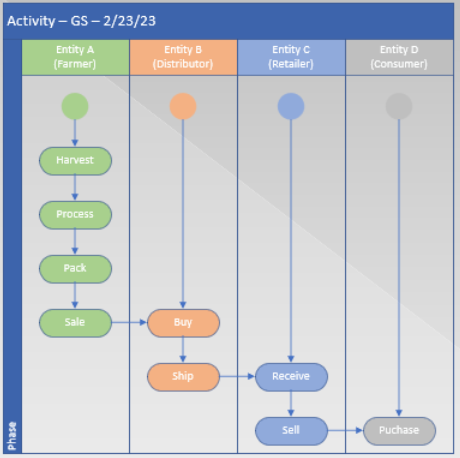
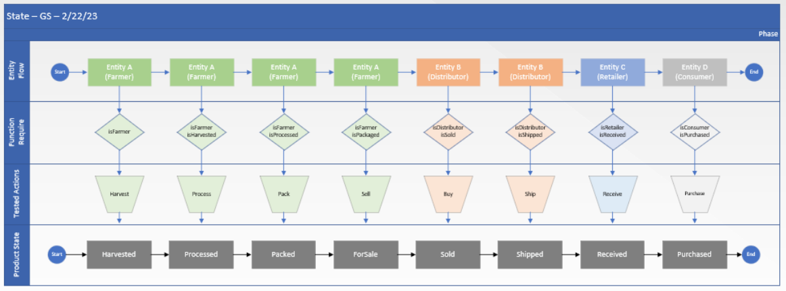
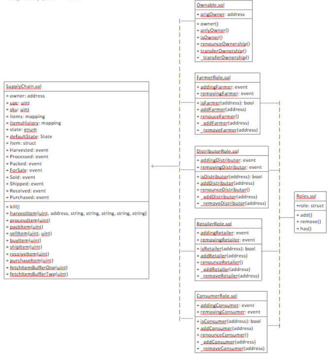

# Supply chain & data auditing

This repository containts an Ethereum DApp that demonstrates a Supply Chain flow between a Seller and Buyer for caffeine beans. The user story is similar to any commonly used supply chain process. A Seller can add items to the inventory system stored in the blockchain. A Buyer can purchase such items from the inventory system. Additionally a Seller can mark an item as Shipped, and similarly a Buyer can mark an item as Received.

## Boilerplate Code

https://github.com/udacity/nd1309-Project-6b-Example-Template
Instructed to use PK provided: spirit, supply, whale...

## Libraries Used

Truffle v4.14.14, Node v18.12.1, Web3.js v1.7.5, Ganache v^7.1.0, Solidity v0.8.0

Please note that IPFS was not utilized

## Diagrams

### Activity

### Sequence

### State

### Classes

## Libraries

### truffle-hdwallet-provider: v^1.0.17

Adopted to connect to Sepolia tesnet and enable web3 provider client side applications

### dotenv: v^16.0.3

Adopted as a method to keep private key and API keys safe

### openzeppelin-solidity: v^3.4.2

Adopted to capitalize upon out-of-the box security tools and infrastructure that are open sourced and community reviewed

### lite-server: v2.4.0

Adopted to host client application and utilize node server

### truffle-assertions: v^0.9.2

Adopted to test smart contracts

### web3: v^1.7.5

Adopted to interact with ethereum nodes

## Write Smart Contracts with Functions

### Criteria

#### SupplyChain.sol contains required tracking functions

Complete - view project-6/contracts/coffeebase/SupplyChain.sol

#### Ownable.sol contains required functions that establish owner and the transfer of ownership

Complete - view project-6/contracts/coffeecore/Owneable.sol

#### ConsumerRole.sol contains required functions that manage the consumer role

Complete - view project-6/contracts/coffeeaccesscontrol/ConsumerRole.sol

#### RetailerRole.sol contains required functions that manage the consumer role

Complete - view project-6/contracts/coffeeaccesscontrol/RetailerRole.sol

#### DistributorRole.sol contains required functions that manage the consumer role

Complete - view project-6/contracts/coffeeaccesscontrol/DistributorRole.sol

#### Additional roles implemented are integrated correctly

Complete - view project-6/contracts/coffeeaccesscontrol/FarmerRole.sol and Roles.sol

## Test smart contract code coverage

Complete

## Deploy smart contract on a public test network (Sepolia)

### Contract Address

https://sepolia.etherscan.io/address/0x5f7e88d34633dbf2da70a52422a18b757c194561

### Transaction ID

https://sepolia.etherscan.io/tx/0x4f2a99581334aa5ecf61c8097a31cfcc36be2553beb613fd7193aa239e5838b2

## Modify client code to interact with smart contracts

From Udacity instructions, "The coffee example in the boilerplate provides this code for you"

I did reference this Mentor response on front-ends to download web3.min.js: https://knowledge.udacity.com/questions/539158 which led me here: https://gist.github.com/andresaaap/29b2d4a4afd842929782f4f28562d7a8 and I then modified the HTML file

## Describing the dApp

### Product Overview

The product overview will allow users to change both the SKU and UPC number via a pop-up toggle or direct editing. By inserting the Current Owner ID address, users can fetch data about product's (coffee) lifecycle

### Farm Details

Every farmer has an **address** that must be inputted and queried against for authenticity. Subsequent Farmer and Farm information will be entered to create a trail of provenance, such as: **name, information** (read as location), **latitude**, and **longitude**.

#### Harvest

The **Harvest** button will allow the Farmer to log the harvest event to the blockchain

#### Process

The **Process** button will allow the Farmer to log the process event to the blockchain

#### Pack

The **Pack** button will allow the Farmer to log the pack event to the blockchain

#### ForSale

The **ForSale** button will allow the Farmer to log the forsale event to the blockchain. Once marked as ForSale, the product (coffee) may be purchased by the distributor

### Product Details

There are three primary roles involved within the product details function that each require separate inputted wallet addresses: **Distributor ID, Retailer ID, and Consumer ID**. The user will log **notes** for the product (description) and its **price** (in ETH). Similar to editing the SKU and UPC, price may be toggled or edited directly

#### Buy

The **Buy** button will allow the distributor to buy the product (coffee) from the farmer and log the event to the blockchain.

#### Ship

The **Ship** button will allow the distributor to ship the product (coffee) from the distributor to the retailer and log the event on the blockchain

#### Receive

The **Receive** button will allow the retailer to mark the product received (coffee) from the distributor and log the event to the blockchain

#### Purchase

The **Purchase** button will allow the consumer to purchase the product (coffee) from the retailer and log the event to the blockchain
