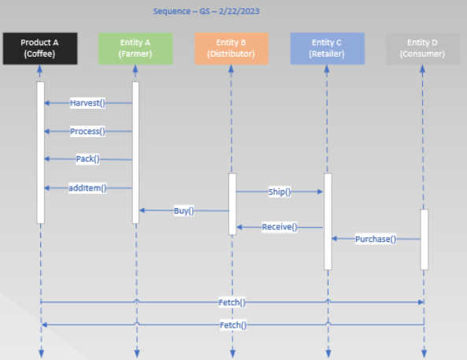

# Supply chain & data auditing

This repository containts an Ethereum DApp that demonstrates a Supply Chain flow between a Seller and Buyer for caffeine beans. The user story is similar to any commonly used supply chain process. A Seller can add items to the inventory system stored in the blockchain. A Buyer can purchase such items from the inventory system. Additionally a Seller can mark an item as Shipped, and similarly a Buyer can mark an item as Received.

## Libraries Used

Truffle v5.5.16 (core: 5.5.16), Node v18.12.1, Web3.js v1.5.3, Ganache v^7.1.0, Solidity v0.8.0

## Diagrams

### Activity

### Sequence

### State

### Classes

## Libraries

### truffle-hdwallet-provider: v^1.0.17

Adopted to connect to Sepolia tesnet and enable web3 provider client side applications

### dotenv: v^16.0.3

Adopted as a method to keep private key and API keys safe

### openzeppelin-solidity: v^3.4.2

Adopted to capitalize upon out-of-the box security tools and infrastructure that are open sourced and community reviewed

### lite-server: v2.4.0

Adopted to host client application and utilize node server

### truffle-assertions: v^0.9.2

Adopted to test smart contracts

### web3: v^1.8.2

Adopted to interact with ethereum nodes

## Write Smart Contracts with Functions

### Criteria

#### SupplyChain.sol contains required tracking functions

Complete - view project-6/contracts/coffeebase/SupplyChain.sol

#### Ownable.sol contains required functions that establish owner and the transfer of ownership

Complete - view project-6/contracts/coffeecore/Owneable.sol

#### ConsumerRole.sol contains required functions that manage the consumer role

Complete - view project-6/contracts/coffeeaccesscontrol/ConsumerRole.sol

#### RetailerRole.sol contains required functions that manage the consumer role

Complete - view project-6/contracts/coffeeaccesscontrol/RetailerRole.sol

#### DistributorRole.sol contains required functions that manage the consumer role

Complete - view project-6/contracts/coffeeaccesscontrol/DistributorRole.sol

#### Additional roles implemented are integrated correctly

Complete - view project-6/contracts/coffeeaccesscontrol/FarmerRole.sol and Roles.sol

## Test smart contract code coverage

Complete

## Deploy smart contract on a public test network (Sepolia)
